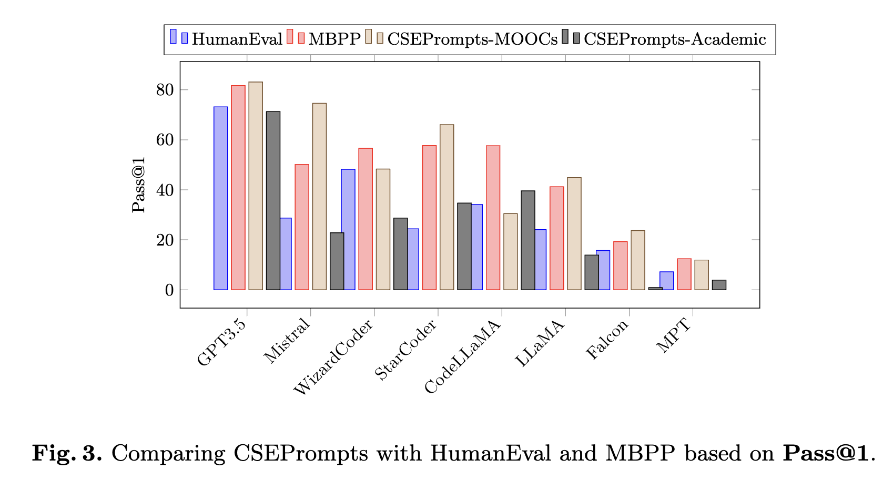
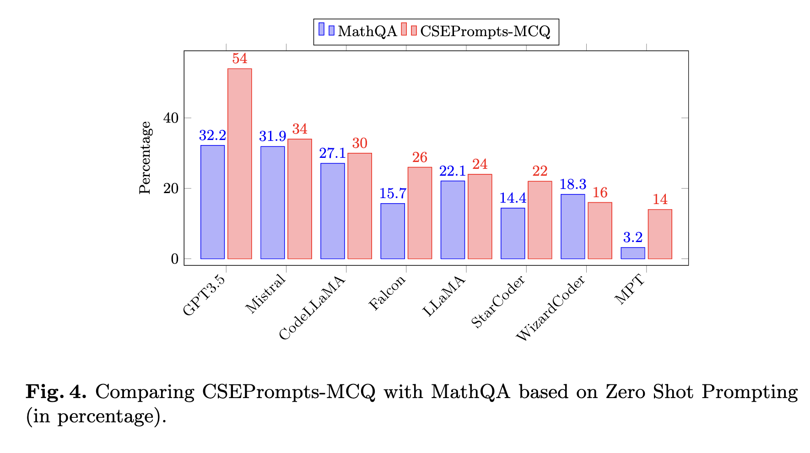

# CSEPrompts: A Benchmark of Introductory Computer Science Prompts

## Overview
- **Title:** CSEPrompts: A Benchmark of Introductory Computer Science Prompts
- **Authors:** Nishat Raihan, Dhiman Goswami, Sadiya Sayara Chowdhury Puspo, Christian Newman, Tharindu Ranasinghe, Marcos Zampieri
- **Institutions:**
  - George Mason University, Fairfax, VA, USA
  - Rochester Institute of Technology, Rochester, NY, USA
  - Aston University, Birmingham, UK
- **Abstract:** CSEPrompts is a framework with hundreds of programming exercise prompts and multiple-choice questions from introductory CS and programming courses. It evaluates the performance of LLMs in generating Python code and answering basic CS questions.

## Introduction
- **Advancements in NLP and LLMs:** GPT-3, GPT-4, and other models revolutionizing text generation and their applications in education.
- **Objective:** Understand the impact of LLMs in CS education and assessment.
- **CSEPrompts:** Comprises 219 programming prompts and 50 MCQs from coding websites and MOOCs.

## Research Questions
1. **RQ1:** LLM performance on introductory CS assignments compared to existing benchmarks.
2. **RQ2:** Performance difference on assignments from coding websites vs. academic MOOCs.
3. **RQ3:** LLMs' performance in generating code vs. answering MCQs.
4. **RQ4:** Performance of Code LLMs vs. raw LLMs.

## Related Work
- Evolution of NLP models from word embeddings to advanced LLMs.
- Impact of GPT models in various domains including education.
- Need for benchmarks specific to educational coding tasks.

## CSEPrompts Dataset
- **Sources:** Coding websites (e.g., CodingBat, LearnPython) and MOOCs (e.g., Harvard's CS50, UMich's PforE).
- **Statistics:** 118 coding prompts from websites, 101 from MOOCs, and 50 MCQs.
- **Collection:** Manual collection ensuring no duplication.

### List of Coding Websites & MOOCs
| Name             | Link                                                           |
|------------------|----------------------------------------------------------------|
| CodingBat        | [https://codingbat.com/python](https://codingbat.com/python)   |
| Learn Python     | [https://www.learnpython.org](https://www.learnpython.org)     |
| Edabit           | [https://edabit.com/challenges/python3](https://edabit.com/challenges/python3) |
| Python Principles| [https://pythonprinciples.com/challenges/](https://pythonprinciples.com/challenges/) |
| Hacker Rank      | [https://www.hackerrank.com/domains/python](https://www.hackerrank.com/domains/python) |
| Edx              | [https://www.edx.org](https://www.edx.org)                     |
| Coursera         | [https://www.coursera.org](https://www.coursera.org)           |
| CS50 (Harvard)   | [https://learning.edx.org/course/course-v1:HarvardX+CS50S+Scratch/home](https://learning.edx.org/course/course-v1:HarvardX+CS50S+Scratch/home) |
| PforE (UMich)    | [https://www.coursera.org/learn/python/home](https://www.coursera.org/learn/python/home) |
| CS1301xI (GT)    | [https://learning.edx.org/course/course-v1:GTx+CS1301xI+1T2023/home](https://learning.edx.org/course/course-v1:GTx+CS1301xI+1T2023/home) |
| CS1301xII (GT)   | [https://learning.edx.org/course/course-v1:GTx+CS1301xII+1T2023/home](https://learning.edx.org/course/course-v1:GTx+CS1301xII+1T2023/home) |
| CS1301xIII (GT)  | [https://learning.edx.org/course/course-v1:GTx+CS1301xIII+1T2023/home](https://learning.edx.org/course/course-v1:GTx+CS1301xIII+1T2023/home) |
| CS1301xIV (GT)   | [https://learning.edx.org/course/course-v1:GTx+CS1301xIV+1T2023/home](https://learning.edx.org/course/course-v1:GTx+CS1301xIV+1T2023/home) |

### Summary of Coding Prompts from Various Sources
|                          | Platform         | Prompts | University | Course      | Prompts | University | Course     | Prompts |
|--------------------------|------------------|---------|------------|-------------|---------|------------|------------|---------|
| **Coding Websites**      | CodingBat        | 24      | **Harvard**| CS50        | 29      | **GT**     | CS1301xI   | 20      |
|                          | LearnPython      | 16      | **UMich**  | PforE       | 7       | **GT**     | CS1301xII  | 8       |
|                          | Edabit           | 29      | **GT**     | CS1301xI    | 11      | **GT**     | CS1301xIII | 6       |
|                          | Python Principles| 26      | **GT**     | CS1301xII   | 20      | **GT**     | CS1301xIV  | 16      |
|                          | HackerRank       | 23      | **GT**     | CS1301xIII  | 17      |            |            |         |
| **Total**                |                  | 118     |            | **Total**   | 101     |            | **Total**  | 50      |

### Statistics for Prompts
| Metric             | CodingSites | Academic | MCQ |
|--------------------|-------------|----------|-----|
| Total Prompts      | 118         | 101      | 50  |
| Max. No. of Tokens | 101         | 372      | 221 |
| Min. No. of Tokens | 5           | 17       | 15  |
| Mean No. of Tokens | 28          | 158      | 106 |
| Standard Deviation | 16          | 72       | 51  |

## Experimental Setup
- **LLMs Tested:** GPT-3.5, Llama2, Falcon, MPT, Code-Llama, StarCoder, WizardCoder, Mistral.
- **Tasks:** Code generation and MCQ answering.
- **Evaluation:** Code snippets tested using pytest, labeled based on test case success.

### LLMs Used on CSEPrompts
| LLM        | Parameter | Model Type | Reference                                   |
|------------|-----------|------------|---------------------------------------------|
| GPT3.5     | 175B      | Base       | [OpenAI2023GPT4TR](https://arxiv.org/abs/2303.08774) |
| Llama2     | 7B        | Base       | [touvron2023llama](https://arxiv.org/abs/2307.09288) |
| Falcon     | 7B        | Base       | [penedo2023refinedweb](https://arxiv.org/abs/2306.14898) |
| MPT        | 7B        | Base       | [mosaicml_mpt30b](https://arxiv.org/abs/2308.00325) |
| Code-Llama | 7B        | Fine-tuned | [roziere2023code](https://arxiv.org/abs/2308.12950) |
| StarCoder  | 7B        | Fine-tuned | [li2023starcoder](https://arxiv.org/abs/2305.06161) |
| WizardCoder| 7B        | Fine-tuned | [luo2023wizardcoder](https://arxiv.org/abs/2306.08568) |
| Mistral    | 7B        | Base       | [jiang2023mistral](https://arxiv.org/abs/2310.06825) |

## Results
- **Comparison with Benchmarks:** CSEPrompts vs. HumanEval and MBPP using Pass@1 metric.
- **MCQ Performance:** Comparison with MathQA-Python benchmark.

### Pass@1 Comparison

### MCQ Performance Comparison

## Conclusion
- **Findings:** Detailed performance analysis of LLMs on CS prompts and MCQs.
- **Future Work:** Expand dataset, include more LLMs for a comprehensive study.

## References
- [OpenAI2023GPT4TR](https://arxiv.org/abs/2303.08774)
- [touvron2023llama](https://arxiv.org/abs/2307.09288)
- [penedo2023refinedweb](https://arxiv.org/abs/2306.14898)
- [mosaicml_mpt30b](https://arxiv.org/abs/2308.00325)
- [roziere2023code](https://arxiv.org/abs/2308.12950)
- [li2023starcoder](https://arxiv.org/abs/2305.06161)
- [luo2023wizardcoder](https://arxiv.org/abs/2306.08568)
- [jiang2023mistral](https://arxiv.org/abs/2310.06825)

## Repository
- **URL:** [CSEPrompts GitHub Repository](https://github.com/mraihan-gmu/CSEPrompts)
